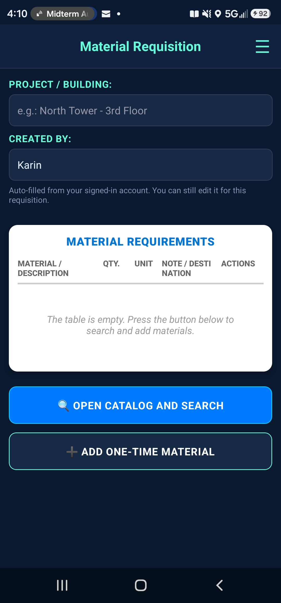
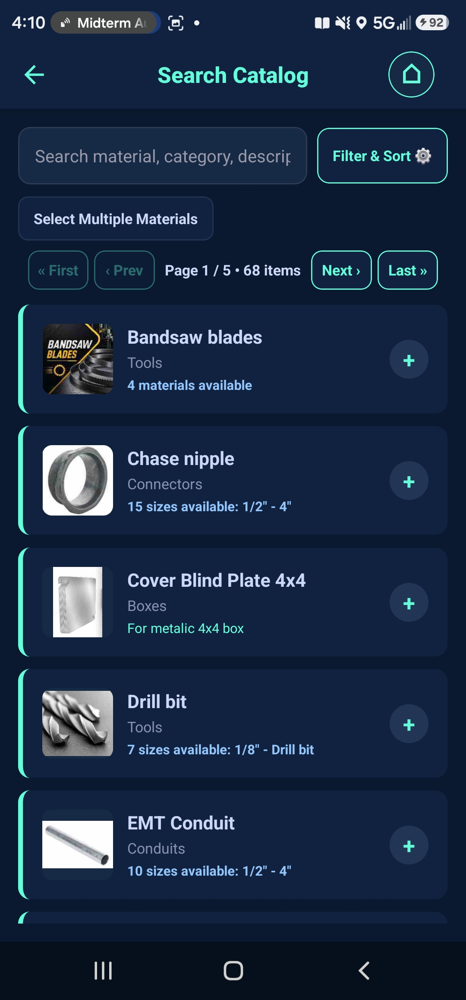
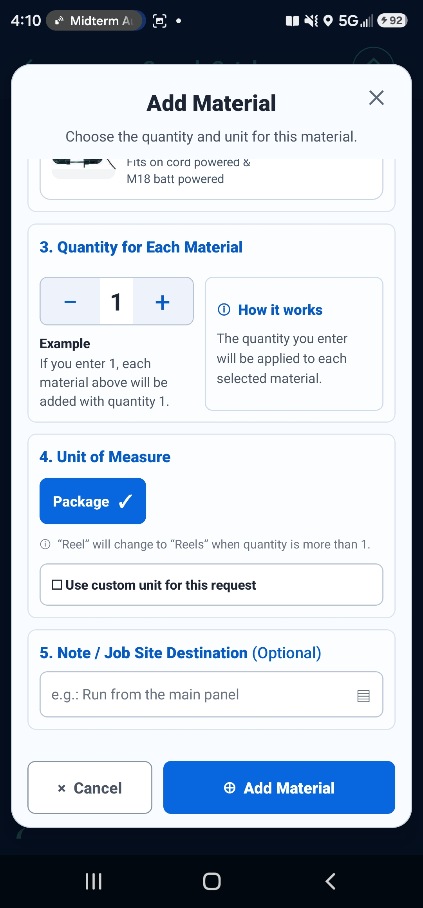
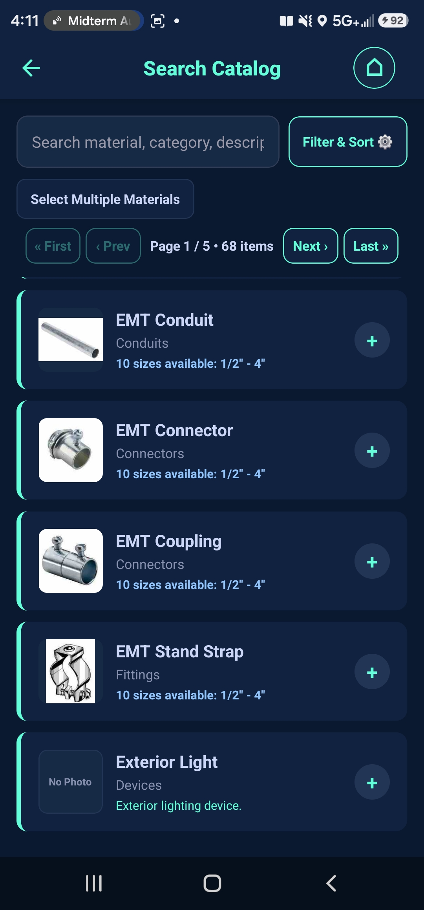
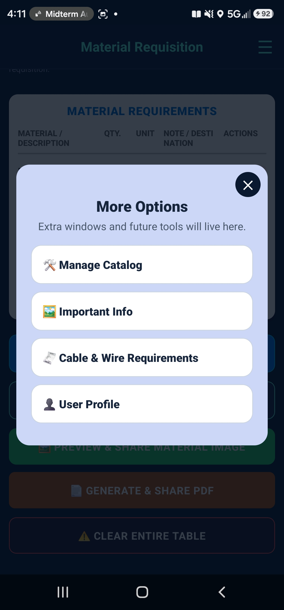
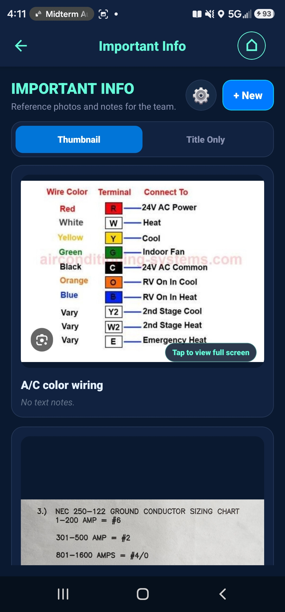
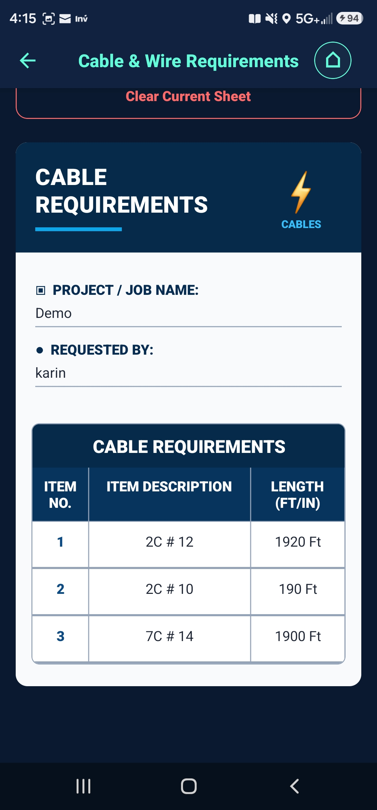

# H. Rocker Material Manager

A mobile application built to simplify material requirements and cable/wire planning for industrial electrical work.

The project combines my experience in industrial electrical work with software development. It is designed around a practical workflow: create material requirements, reuse a shared material catalog, keep working data available locally, and generate documents that can be shared from a mobile device.

## Current Features

- User authentication with registered and guest sessions.
- Material Requirements creation with project/building information.
- Searchable reusable material catalog.
- Material catalog management with categories, units, descriptions, and images.
- Cable and Wire Requirements with reusable cable/wire names.
- Local storage for active working data and cached catalog information.
- Firebase-backed shared data for information that needs to be available across devices.
- Image caching to reduce repeated network downloads.
- PDF and image generation for sharing material requirements.
- Android Back button handling for navigation, modals, and editors.
- User profile and role-aware application behavior.

## Application Preview

The screenshots below show the current Android application running on a physical device.

### Material Requirements and Catalog

<p align="center">
  
  
  
</p>

The main workflow lets a user create a material requirement, search a reusable catalog, choose material variants, quantities, units, and optional job-site notes.

### Generated Requirements and Field Reference

<p align="center">
  
  
  
</p>

Material requirements can be previewed and shared as an image or PDF. The application also provides an Important Info area for team reference photos and notes, plus a dedicated Cable & Wire Requirements workflow.

### Cable Requirements Output

<p align="center">
  
</p>

The Cable & Wire workflow can generate a structured requirement sheet containing the project name, requester, cable description, and required length.

## Technology Stack

**Application**
- JavaScript
- React
- React Native
- Expo

**Navigation and Interface**
- React Navigation
- React Native Gesture Handler
- React Native Safe Area Context

**Local Data**
- AsyncStorage
- Expo SQLite
- Expo File System

**Cloud Services**
- Firebase Authentication
- Firebase Realtime Database
- Firebase Storage

**Documents and Sharing**
- Expo Print
- Expo Sharing
- React Native View Shot

## Data and Sync Approach

The application separates temporary working data from shared reusable data.

Active requirement drafts are kept locally so routine editing does not require a cloud request. Reusable catalog information can be synchronized with Firebase and cached on the device for continued access.

The data layer also includes incremental synchronization and local image caching. These choices are intended to reduce unnecessary Firebase traffic while keeping shared catalog information available across devices.

For Cable and Wire Requirements, lengths and active requirement rows remain local working data. A new reusable cable or wire name is uploaded only when the user chooses to save it to the shared catalog.

## Project Structure

```text
.
├── App.js
├── index.js
├── assets/
└── src/
    ├── components/
    ├── database/
    ├── hooks/
    ├── screens/
    └── theme/
```

- `components/` contains reusable interface components.
- `database/` contains authentication, Firebase configuration, local storage, caching, and synchronization logic.
- `hooks/` contains reusable application hooks.
- `screens/` contains the main application screens and workflows.
- `theme/` contains shared visual configuration.

## Main Application Screens

- Material Requirements
- Search Catalog
- Manage Catalog
- Add New Material
- Important Information
- Cable & Wire Requirements
- User Profile
- Authentication

## Running the Project

### Requirements

- Node.js
- npm
- Expo-compatible development environment

### Install dependencies

```bash
npm install
```

### Start the Expo development server

```bash
npm start
```

The project also includes scripts for Android development builds and Expo project checks.

## Project Status

This project is under active development. Features and data structures may continue to change as the application is tested and expanded.

## Why I Built It

Working in industrial electrical environments gave me direct experience with the challenges of organizing material information and communicating requirements between people involved in a project.

I started this application to explore how software could make that workflow easier while also developing my skills in mobile development, local data management, cloud synchronization, authentication, and application architecture.

## Author

**Mr. Karin Ramirez**  
Computer Science Student & Software Developer
